# 💻 Lab 01 - VS Code & Git Setup

Welcome to the first lab of our "Git in Gear" Workshop! In this lab, we will lay the foundation by setting up your environment with Visual Studio Code and Git. We will also link your local Git setup with your Azure DevOps project using VS Code's graphical interface.

## Objective

This Lab aims to:

- Introduce you to the Visual Studio Code environment.
- Set up Git on your system.
- Create your first local Git repository.
- Link your local Git repository to Azure DevOps.

## Requirements

- Ensure that Visual Studio Code and Git are installed on your system. If not, download them from their respective websites ([VS Code](https://code.visualstudio.com/download), [Git](https://git-scm.com/downloads)) and follow the installation instructions.
- Azure DevOps account with access to the provided project.

### Task 1: Install Visual Studio Code

### Task 2: Install and Configure Git

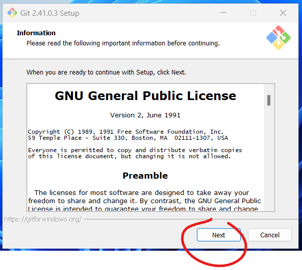
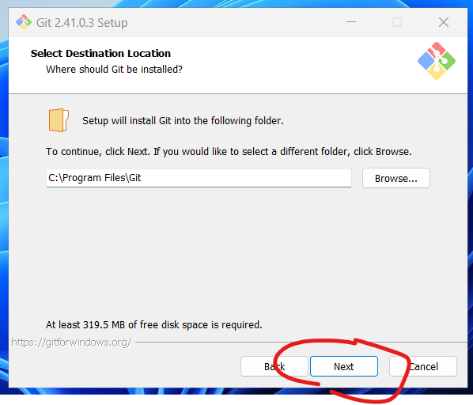
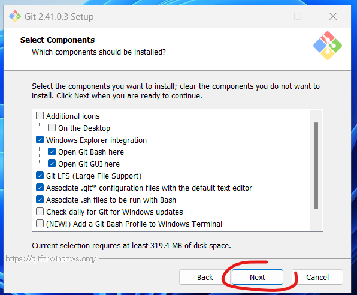
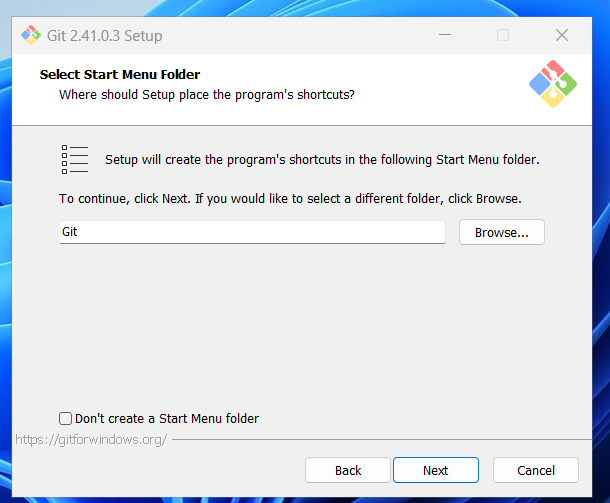
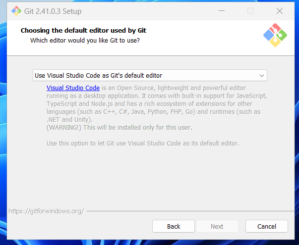
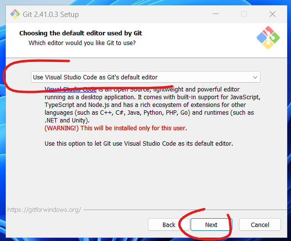
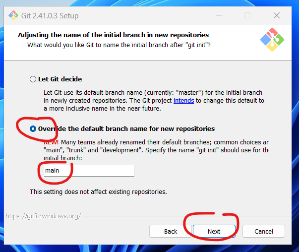
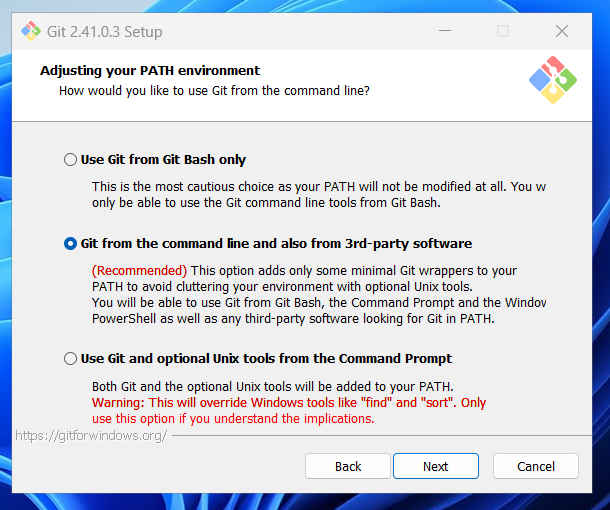
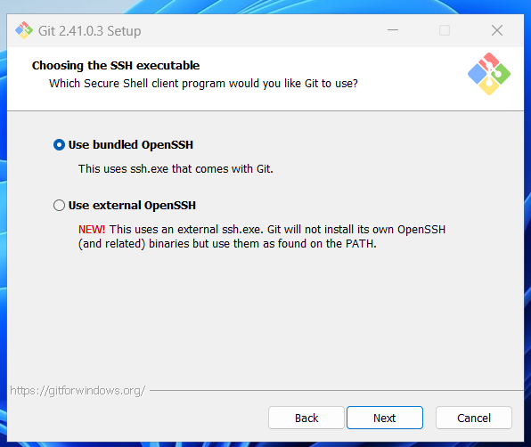
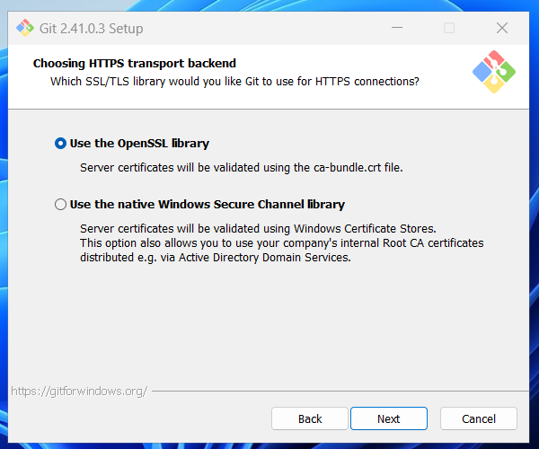
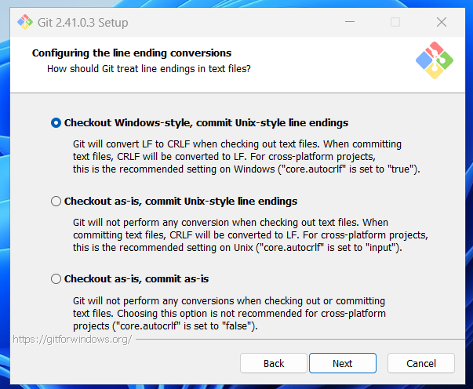
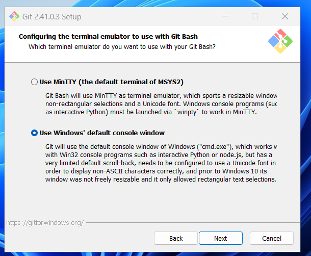

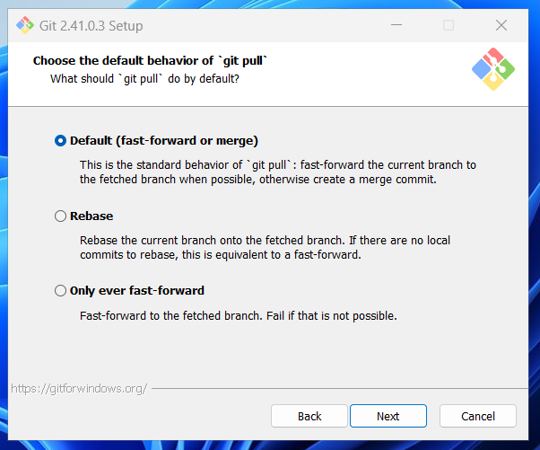

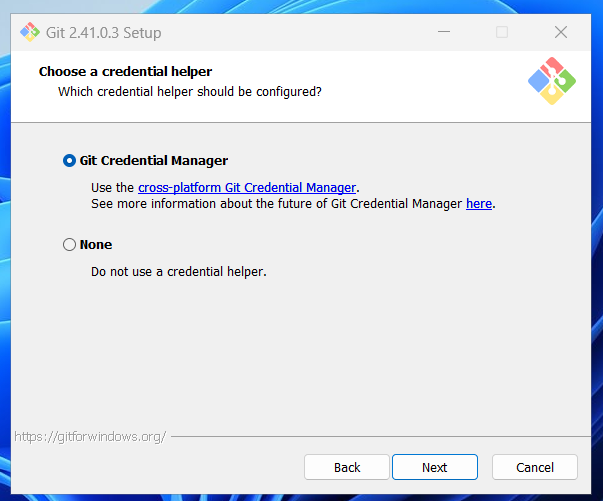
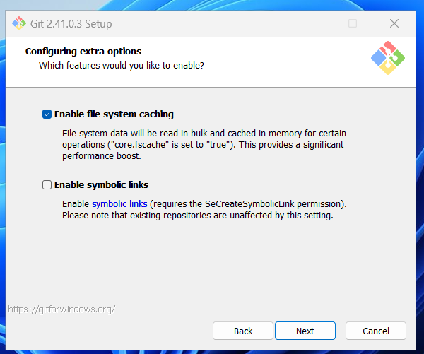
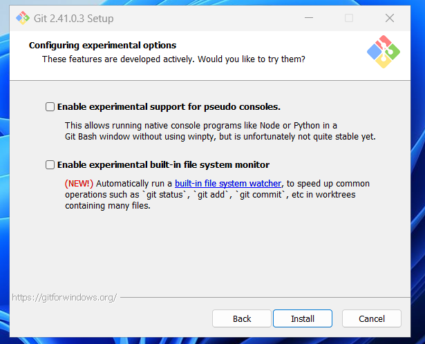
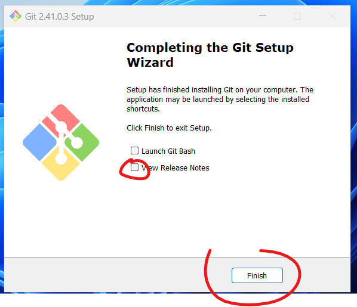

### Task 3: Familiarize Yourself with VS Code

1. Open Visual Studio Code (VS Code).
2. Explore the user interface. Here are few points of interest:
   - The activity bar on the side provides quick access to various views like Explorer, Search, Source Control, etc.
   - The status bar at the bottom provides information about your project and the files you're working on.

### Task 4: Verify Git Installation

1. Open the Command Palette (`F1` or `Ctrl+Shift+P` on Windows and Linux, `Cmd+Shift+P` on Mac).
2. Type `Git: Show Git Output`, and you should see Git's output in a new output window at the bottom, indicating that Git is installed and integrated with VS Code.

### Task 5: Create your First Local Git Repository

1. Choose a directory where you want to create your repository. In VS Code, click `File` > `Open Folder` and navigate to your chosen directory.
2. Click on the Source Control view in the activity bar on the side.
3. Click on `Initialize Repository`. This creates a new Git repository in your chosen directory.

### Task 6: Link Your Local Git Repository to Azure DevOps

1. Navigate to your Azure DevOps project in your web browser.
2. Click on 'Repos' and then 'Files'.
3. Copy the repository's URL by clicking on 'Clone' and then 'Copy to clipboard'.
4. Go back to VS Code.
5. Open the Command Palette (`F1` or `Ctrl+Shift+P` on Windows and Linux, `Cmd+Shift+P` on Mac).
6. Type `Git: Add Remote` and press `Enter`.
7. Provide `origin` as the name of the remote and press `Enter`.
8. Paste the copied Azure DevOps URL as the URL of the remote and press `Enter`.

Congrats! You have now set up your Visual Studio Code with Git and linked your local repository to Azure DevOps. Now you're ready to move onto the next Lab where you'll learn basic Git operations.

## Summary

In this lab, you've learned about Visual Studio Code and how to set up a Git environment within it using its GUI. You also created your first local Git repository and linked it to Azure DevOps, paving the way for an integrated development workflow. Well done! Now, it's time to move on to the next Lab, where we'll dive into basic Git operations.

[Proceed to Lab 02 - Basic Git Operations](./lab-02/README.md)

