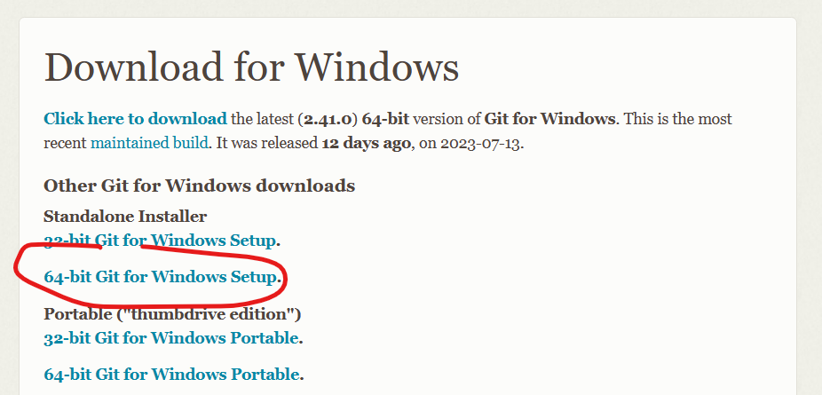

## Steps 

### Step 1: Install VS Code

### Step 2: Install and Configure Git

### Step 3: Initialize Your First Local Git Repository

In VS Code:

1. Open the Command Palette with `Ctrl + Shift + P` or by going to View > Command Palette.
2. Type `Git: Initialize Repository`.
3. Select the directory where you want your repository to be.
4. A new pane titled 'Source Control' should appear on the left, confirming that your local Git repository is ready.

### Step 4: Link Your Local Repository with Your Azure DevOps Account

For this step, we will need to create a new repository on Azure DevOps and then clone it on your local machine. 

1. Visit your Azure DevOps portal and create a new Git repository under your project.

2. After the repository is created, click on the "Clone" button in the upper right corner, and copy the repository's URL.

3. Now, go back to VS Code.

4. Click on the 'Clone Repository' button in the Source Control view or use the `Ctrl + Shift + P` command and type `Git: Clone`.

5. Paste the URL of the repository you copied earlier.

6. Choose a directory on your local machine where you want the cloned repository to be placed.

VS Code will clone the repository from Azure DevOps and open it for you. Your local Git repository is now linked to your Azure DevOps repository.

## Conclusion

Congratulations on setting up your VS Code and Git environment with Azure DevOps! You have configured Git, initialized a local repository, and linked it with Azure DevOps, all from within VS Code's GUI. In the next lab, we'll delve deeper into the Azure DevOps integration with VS Code. Great work and see you in the next lab!
